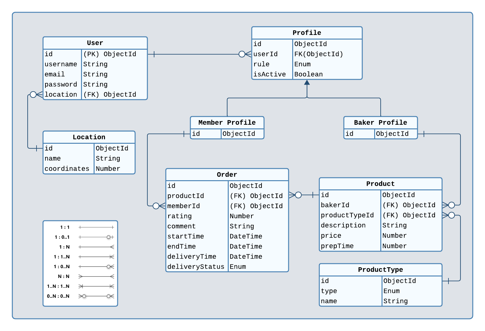

# CakePals Backend API

Welcome to the CakePals Backend API project! This project aims to create an API for CakePals, an application where users can buy and sell home-baked cakes and pies.

## Table of Contents

- [Introduction](#introduction)
- [Features](#features)
- [Project Structure](#project-structure)
- [Getting Started](#getting-started)
- [Designing the Data Models](#designing-the-data-models)
- [Order Process Machine](#order-process)
- [API Documentation](#api-documentation)
- [Manual](#manual)
- [Development Directory](#development-directory)
- [Edge Cases](#edge-cases)
- [Date and Time Handling](#date-and-time-handling)

## Introduction

CakePals is a platform that facilitates the buying and selling of homemade cakes and pies. The application supports three types of users: Guests (unauthenticated users), Members, and Bakers. Members can place orders for baked goods, while Bakers can list their products, fulfill orders, and manage their profiles.

## Features

- New account registration (as a Member or Baker).
- Authentication for Bakers and Members.
- Bakers can add, edit, and remove products for sale.
- All users can list available products, filtered by location and type.
- Users can view a baker's profile and rating.
- Members can view available collection times and place orders.
- Bakers can view, accept, reject, and fulfill orders.
- Customers can rate fulfilled orders, contributing to the overall baker's rating.

## Project Structure

The project follows a modular architecture, with separate modules for each feature (e.g., User, Profile, Product, Order). Each module contains its own routes, controllers, models, providers, and validation logic.

```
/src
  /modules
    /user
      ...
    /profile
      ...
    /product
      ...
    /order
      ...
  /shared
    ...
  ...
```

> More details about the project structure in [the project plan docs](./development/project-plan/index.md)

## Getting Started

To run the CakePals API locally, follow these steps:

1. Clone the repository.
2. Install the necessary dependencies with `npm install`.
3. Set up your environment variables (e.g., database connection, JWT secret).
4. Start the application with `npm start`.

OR run using docker

1. Clone the repository.
2. Install Docker and Docker Compose.
3. Ensure that ports `8080` and `7017` are available.
4. Navigate to the project's root directory.
5. Run the command `docker compose up --build`.

## Designing the Data Models

These models will define the structure of the data that will be stored in the database.

### Entities

- User
- Profile
- Order
- Product
- ProductType
- Location

### Diagram



> More details about the entities and their relationships in [the project plan docs](./development/project-plan/step-03-designing-the-data-models.md)

## Order Process

Below is a visual representation of the Order Process Machine:


This diagram illustrates the states and events involved in the order management process.

> More details about the entities and their relationships in [the project plan docs](./development/project-plan/step-06-implementing-business-logic.md)

## API Documentation

Please refer to the [API documentation](development/api-docs/index.md) for detailed information on available endpoints, request/response formats, and usage examples.

## Manual

The [manual](development/manual/index.md) provides additional insights, usage tips, and instructions for various aspects of the application.

## Development Directory

Inside the [development](development) directory, you'll find:

- [API documentation](development/api-docs/index.md): Detailed API documentation with examples.
- [Manual](development/manual/index.md): Additional usage instructions and insights.
- [Project plan](development/project-plan/index.md): A detailed plan outlining the development process.

## Edge Cases

- **Baker's Collection Time Range**: Orders can only be placed during the time range specified by the Baker in their profile.
- **No Orders in Progress**: Orders can only be placed when the Baker is not currently fulfilling another order.
- **Start Time Calculation**: To calculate the order start time, the delivery time is subtracted from the product's preparation time (Order.deliveryTime - Product.prepTime = Order.startTime). The Order.startTime must be later than the BakerProfile.collectionTimeRange.startTime.

## Date and Time Handling

We use the Luxon library to handle date and time in the application. Dates and times are stored in minutes for precise calculations. For example, collectionTimeRange is represented as:

```json
{
  "startTime": 600,   // 10:00 AM
  "endTime": 1020     // 5:00 PM
}
```

Using minutes allows us to easily perform calculations and validations while ensuring accuracy in time-based operations.

> More details and examples for time managing and handling in [the manual](./development/manual/man-02-manage-time.md)

Explore the codebase, API documentation, and manual for more details about specific endpoints, models, and functionalities. If you have any further questions or need assistance, please don't hesitate to reach out.

