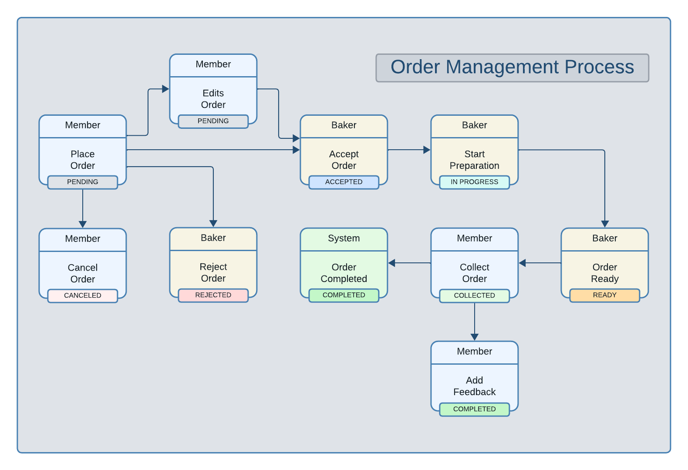

# Business Logic for Order State Machine

## Order Management Process Flow



## States
- **OrderStatus**
  - Pending
  - Accepted
  - Rejected
  - Canceled
  - Completed
- **CollectionStatus**
  - None
  - In Progress
  - Ready
  - Collected

## Events

| Event             | Role   | Allowed Status         | Updated Order Status | Updated Collection Status |
| ----------------- | ------ | ---------------------- | -------------------- | ------------------------- |
| Place Order       | Member | N/A                    | `Pending`            | `None`                    |
| Edit Order        | Member | `Pending`              | `Pending`            | -                         |
| Accept Order      | Baker  | `Pending`              | `Accepted`           | -                         |
| Reject Order      | Baker  | `Pending`              | `Rejected`           | -                         |
| Cancel Order      | Member | `Pending`, `Accepted`* | `Canceled`           | -                         |
| Start Preparation | Baker  | `Accepted`             | -                    | `In Progress`             |
| Order Ready       | Baker  | `In Progress`          | -                    | `Ready`                   |
| Collect Order     | Member | `Ready`                | `Completed`          | `Collected`               |
| Add Feedback      | Member | `Completed`            | -                    | -                         |

> \* The Member can cancel the Order when its Order status is `Accepted` only if its Collection status is `None`. Cancellation of an order is not possible while the baker is working on it.

## Implementation

This section outlines the business logic to be implemented based on the defined states and events.

### Place Order
- **Role**: Member
- **Allowed Status**: None
- **Updated Order/Collection Status**: `Pending` / `None`
- **API Route**: `POST /api/orders`
- **Controller**: `OrderController.placeOrder`
- **Required Data**:
  - `member`: ObjectId (Reference to Profile, Required)
  - `product`: ObjectId (Reference to Product, Required)
  - `paymentMethod`: Enum ('Credit Card', 'PayPal', 'Cash') (Required)
  - `collectionTime`: DateTime (Required)

### Edit Order
- **Role**: Member
- **Allowed Status**: `Pending`
- **Updated Order/Collection Status**: `Pending` / `None`
- **API Route**: `PUT /api/orders/:orderId`
- **Controller**: `OrderController.editOrder`
- **Required Data**:
  - `paymentMethod`: Enum ('Credit Card', 'PayPal', 'Cash') (Required)
  - `collectionTime`: DateTime (Required)

### Accept Order
- **Role**: Baker
- **Allowed Status**: `Pending`
- **Updated Order/Collection Status**: `Accepted` / `None`
- **API Route**: `/:orderId/accept`
- **Controller**: `OrderController.acceptOrder`
- **Required Data**: None

### Reject Order
- **Role**: Baker
- **Allowed Status**: `Pending`
- **Updated Order/Collection Status**: `Rejected` / `None`
- **API Route**: `/:orderId/reject`
- **Controller**: `OrderController.rejectOrder`
- **Required Data**: None

### Cancel Order
- **Role**: Member
- **Allowed Status**: `Pending`, `Accepted` & `None`*
- **Updated Order/Collection Status**: `Canceled` / `None`
- **API Route**: `PATCH /api/orders/:orderId/cancel`
- **Controller**: `OrderController.cancelOrder`
- **Required Data**: None

### Start Preparation
- **Role**: Baker
- **Allowed Status**: `Accepted`
- **Updated Order/Collection Status**: `Accepted` / `In Progress`
- **API Route**: `/:orderId/start-preparation`
- **Controller**: `OrderController.startPreparation`
- **Required Data**: None

### Order Ready
- **Role**: Baker
- **Allowed Status**: `In Progress`
- **Updated Order/Collection Status**: `Accepted` / `Ready`
- **API Route**: `/:orderId/order-ready`
- **Controller**: `OrderController.orderReady`
- **Required Data**: None

### Collect Order
- **Role**: Member
- **Allowed Status**: `Ready`
- **Updated Order/Collection Status**: `Accepted` / `Completed`
- **API Route**: `PATCH /api/orders/:orderId/collect`
- **Controller**: `OrderController.collectOrder`
- **Required Data**: None

### Add Feedback
- **Role**: Member
- **Allowed Status**: `Completed`
- **Updated Order/Collection Status**: `Accepted` / `Completed`
- **API Route**: `PATCH /api/orders/:orderId/feedback`
- **Controller**: `OrderController.addFeedback`
- **Required Data**:
  - `rating`: Number (Required)
  - `comment`: String

## Test Cases

### Place Order

- **Endpoint**: `POST /api/orders`
- **Handler**: `OrderController.placeOrder`
- **Input**:
  - Request Body:
    ```json
    {
      "product": "650fa1bf547bf972158e341f",
      "member": "650f2a1fa60ccaf0796e5e3c",
      "paymentMethod": "Credit Card",
      "collectionTime": "2023-09-24T14:00:00.000Z"
    }
    ```
- **Expected Result**: 
  - Status Code: 201
  - Response Body:
    ```json
    {
      "message": "Order placed successfully"
    }
    ```

### Accept Order

- **Endpoint**: `PATCH /api/orders/:orderId/accept`
- **Handler**: `OrderController.acceptOrder`
- **Input**:
  - URL Parameter: `orderId` - ID of the order to accept
- **Expected Result**: 
  - Status Code: 200
  - Response Body:
    ```json
    {
      "message": "Order accepted successfully"
    }
    ```

### Reject Order

- **Endpoint**: `PATCH /api/orders/:orderId/reject`
- **Handler**: `OrderController.rejectOrder`
- **Input**:
  - URL Parameter: `orderId` - ID of the order to reject
- **Expected Result**: 
  - Status Code: 200
  - Response Body:
    ```json
    {
      "message": "Order rejected successfully"
    }
    ```

### Start Preparation

- **Endpoint**: `PATCH /api/orders/:orderId/start-preparation`
- **Handler**: `OrderController.startPreparation`
- **Input**:
  - URL Parameter: `orderId` - ID of the order to start preparation
- **Expected Result**: 
  - Status Code: 200
  - Response Body:
    ```json
    {
      "message": "Order preparation started"
    }
    ```

### Order Ready

- **Endpoint**: `PATCH /api/orders/:orderId/order-ready`
- **Handler**: `OrderController.orderReady`
- **Input**:
  - URL Parameter: `orderId` - ID of the order that is ready
- **Expected Result**: 
  - Status Code: 200
  - Response Body:
    ```json
    {
      "message": "Order is ready for collection"
    }
    ```

### Collect Order

- **Endpoint**: `PATCH /api/orders/:orderId/collect`
- **Handler**: `OrderController.collectOrder`
- **Input**:
  - URL Parameter: `orderId` - ID of the order to be collected
  - Request Body:
    ```json
    {
      "actualCollectionTime": "2023-09-24T14:30:00.000Z"
    }
    ```
- **Expected Result**: 
  - Status Code: 200
  - Response Body:
    ```json
    {
      "message": "Order collected successfully"
    }
    ```

### Add Feedback

- **Endpoint**: `PATCH /api/orders/:orderId/feedback`
- **Handler**: `OrderController.addFeedback`
- **Input**:
  - URL Parameter: `orderId` - ID of the order to provide feedback
  - Request Body:
    ```json
    {
      "rating": 5,
      "comment": "Excellent service!"
    }
    ```
- **Expected Result**: 
  - Status Code: 200
  - Response Body:
    ```json
    {
      "message": "Feedback added successfully"
    }
    ```

### Cancel Order

- **Endpoint**: `PATCH /api/orders/:orderId/cancel`
- **Handler**: `OrderController.cancelOrder`
- **Input**:
  - URL Parameter: `orderId` - ID of the order to cancel
- **Expected Result**: 
  - Status Code: 200
  - Response Body:
    ```json
    {
      "message": "Order cancelled successfully"
    }
    ```
